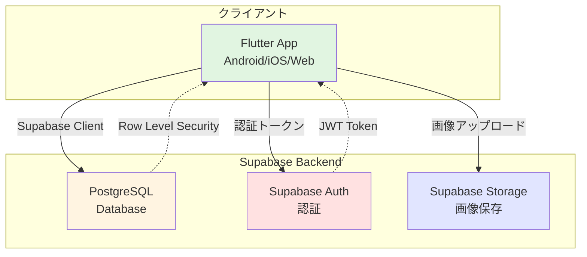
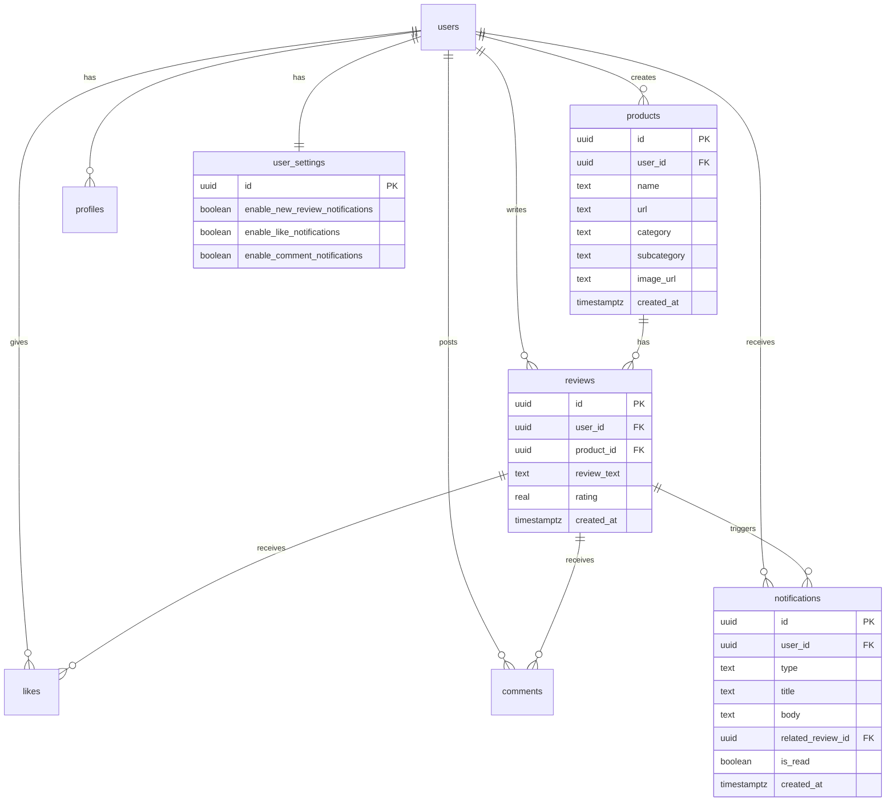

# FavLog (Favorite Log)

<div align="center">

**信頼できる仲間と商品・サービスのレビューを共有するクローズドコミュニティアプリ**

[](https://flutter.dev/)
[](https://dart.dev/)
[](https://supabase.com/)

[機能紹介](#主な機能) | [セットアップガイド](#環境セットアップ) | [ドキュメント](#ドキュメント)

</div>

---

## 📚 目次

- [概要](#概要)
- [主な機能](#主な機能)
- [技術スタック](#技術スタック)
- [アーキテクチャ](#アーキテクチャ)
- [環境セットアップ](#環境セットアップ)
- [セキュリティ](#セキュリティ)
- [ドキュメント](#ドキュメント)
- [テスト](#テスト)
- [今後の拡張](#今後の拡張)
- [開発者情報](#開発者情報)

---

## 概要

FavLogは、クローズドなコミュニティ（友人、家族、同僚など）内で商品やサービスのレビューを共有するためのAndroidアプリケーションです。検索アルゴリズムではなく、信頼できる関係に基づいた選択を支援します。

**特徴:**
- 📝 詳細なレビュー投稿（0.5単位の星評価、カテゴリ、サブカテゴリ）
- 💬 ソーシャル機能（いいね、コメント、通知）
- 🔔 リアルタイム通知（新規レビュー、いいね、コメント）
- 🔍 高度な検索・フィルタリング
- 📱 レスポンシブデザイン（モバイル・タブレット・Web対応）
- 🔒 Row Level Security（RLS）によるセキュアなデータ管理

---

## 主な機能

### 1. レビュー管理

#### レビュー投稿
- **商品情報**: 商品名、URL、カテゴリ、サブカテゴリ（オートコンプリート対応）
- **評価システム**: 0.5単位の星評価（1.0〜5.0）
- **画像アップロード**: 自動的にWebP/JPEG形式に変換・圧縮
- **詳細レビュー**: 自由記述のレビューテキスト

#### レビュー表示
- **ホーム画面**: 商品の平均評価と最新レビュー1件を表示
- **詳細画面**: 商品のすべてのレビューを一覧表示
- **無限スクロール**: 動的なデータ読み込み
- **Shimmer効果**: ローディング中の視覚的フィードバック
- **プルツーリフレッシュ**: 手動データ更新

#### レビュー編集・削除
- **編集機能**: 自身のレビューの評価とテキストを更新可能
- **削除機能**: 自身のレビューを削除可能
- **商品情報編集**: RLSポリシーにより、作成者のみが商品情報を編集可能

### 2. ソーシャル機能

#### いいね機能
- レビューに対していいねを付与
- いいね数のリアルタイム表示
- ハートアイコンで視覚的フィードバック
- いいね時にレビュー作成者に通知

#### コメント機能
- レビューに対してコメントを投稿
- ユーザーのプロフィール画像と名前を表示
- 自分のコメントは削除可能
- コメント投稿時にレビュー作成者に通知

#### 🔔 通知機能
- **新規レビュー通知**: すべてのユーザーに通知
- **いいね通知**: 自分が書いたレビューにいいねがついたときに通知
- **コメント通知**: 自分が書いたレビューにコメントがついたときに通知
- **通知設定**: 設定画面で各通知タイプごとにON/OFF可能
- **既読管理**: 通知の既読/未読状態を管理
- **通知バッジ**: 未読通知数を視覚的に表示

### 3. 検索・フィルタリング

#### カテゴリフィルタリング
- ホーム画面でカテゴリを選択してレビューを絞り込み
- 「すべて」カテゴリで全レビューを表示

#### 検索機能
- 専用の検索画面で横断検索
- 商品名、サービス名、タグ、ユーザー名で検索可能
- デバウンス処理によるリアルタイム検索
- 検索結果の0.5単位星評価表示

#### ソート機能
- 「すべて」「新しい順」「高評価順」でソート

### 4. プロフィール管理

- **ユーザー名設定**: 一意のユーザー名
- **アバター画像**: プロフィール画像のアップロード・更新
- **自動削除**: 既存アバターの自動削除機能

### 5. 認証機能

- **ユーザー登録**: メールアドレスとパスワード
- **ログイン/ログアウト**: セキュアな認証フロー
- **メール認証**: 認証メールの送信と再送機能
- **JWT管理**: 有効期限切れ時の自動ログアウトと再認証誘導

---

## 技術スタック

### クライアント
| 技術 | バージョン | 用途 |
|------|-----------|------|
| **Flutter** | 3.10+ | クロスプラットフォームフレームワーク |
| **Dart** | 3.10+ | プログラミング言語 |
| **Riverpod** | 2.5.1 | 状態管理 |
| **go_router** | 17.0.0 | ルーティング・ナビゲーション |
| **cached_network_image** | 3.3.1 | 画像キャッシュ |
| **shimmer** | 3.0.0 | ローディングエフェクト |
| **intl** | 0.19.0 | 国際化・日付フォーマット |
| **timeago** | 3.7.0 | 相対時刻表示 |
| **badges** | 3.1.2 | 通知バッジ |

### バックエンド
| サービス | 用途 |
|----------|------|
| **Supabase PostgreSQL** | リレーショナルデータベース |
| **Supabase Auth** | ユーザー認証・セッション管理 |
| **Supabase Storage** | 画像ストレージ（product_images、avatars） |
| **Supabase RLS** | Row Level Security（行レベルセキュリティ） |

### ユーティリティ
| ライブラリ | 用途 |
|-----------|------|
| **flutter_dotenv** | 環境変数管理 |
| **image** | 画像処理 |
| **flutter_image_compress** | WebP/JPEG画像圧縮 |
| **url_launcher** | URLリンクの起動 |
| **image_picker** | 画像選択 |
| **uuid** | UUIDの生成 |

---

## アーキテクチャ

### システム構成図



### データベーススキーマ



### レスポンシブデザイン

| デバイス | 画面幅 | レイアウト |
|---------|--------|-----------|
| **スマートフォン** | < 600px | `ListView`（縦一列） |
| **タブレット** | 600px〜1200px | `GridView`（2列） |
| **デスクトップ** | > 1200px | `GridView`（3列以上） |

---

## 環境セットアップ

### 前提条件

- **Flutter SDK**: 3.10以上 - [インストールガイド](https://flutter.dev/docs/get-started/install)
- **Android Studio**: [ダウンロード](https://developer.android.com/studio)
- **Git**: [ダウンロード](https://git-scm.com/downloads)
- **Supabaseアカウント**: [登録](https://supabase.com/)

### クイックスタート

#### 1. リポジトリのクローン

```bash
git clone https://github.com/kyo09427/favlog_app.git
cd favlog_app
```

#### 2. 依存関係のインストール

```bash
flutter pub get
```

#### 3. Flutter環境の確認

```bash
flutter doctor
```

問題がある場合は、出力される指示に従って修正してください。

#### 4. 環境変数の設定

プロジェクトのルートに `.env` ファイルを作成し、以下を記述：

```env
SUPABASE_URL=https://YOUR_PROJECT_REF.supabase.co
SUPABASE_ANON_KEY=eyJ...
```

> **⚠️ 重要**: `.env`ファイルは`.gitignore`に含まれており、Gitにコミットされません。

#### 5. アセットの配置

`assets/categories.json` を作成し、以下を記述：

```json
{
  "categories": [
    "すべて",
    "本",
    "家電",
    "食品",
    "ファッション",
    "ゲーム",
    "映画/音楽",
    "サービス",
    "その他"
  ]
}
```

#### 6. Supabaseのセットアップ

詳細な手順は **[docs/database_setup.md](docs/database_setup.md)** を参照してください。

主なステップ：
- Supabaseプロジェクトの作成
- データベーステーブルの作成（products, profiles, reviews, likes, comments, notifications, user_settings）
- RLSポリシーの設定
- Storageバケットの作成（product_images, avatars）

#### 7. アプリケーションの実行

```bash
flutter run
```

エミュレータまたは接続されたデバイスでアプリケーションが起動します。

---

## セキュリティ

### Row Level Security (RLS)

FavLogアプリでは、Supabaseの**Row Level Security（行レベルセキュリティ）**を活用し、データへのアクセスを細かく制御しています。

#### 主要なセキュリティポリシー

| テーブル | ポリシー | 説明 |
|---------|---------|------|
| **products** | 作成者のみ編集可能 | `auth.uid() = user_id` |
| **reviews** | 作成者のみ編集/削除可能 | `auth.uid() = user_id` |
| **likes** | 作成者のみ削除可能 | `auth.uid() = user_id` |
| **comments** | 作成者のみ編集/削除可能 | `auth.uid() = user_id` |
| **notifications** | 自分の通知のみ閲覧/更新/削除可能 | `auth.uid() = user_id` |
| **user_settings** | 自分の設定のみ閲覧/更新可能 | `auth.uid() = id` |

#### セキュリティチェックリスト

- [x] APIキーは`.env`ファイルに保存（`.gitignore`で除外）
- [x] RLSポリシーによるデータベースレベルのアクセス制御
- [x] JWT有効期限切れ時の自動ログアウト
- [x] 画像アップロードの認証必須
- [x] 通知の送信者検証

詳細は **[docs/technical_details.md](docs/technical_details.md)** を参照してください。

### プラットフォーム別画像最適化

セキュリティとパフォーマンスを両立するため、プラットフォームに応じて画像形式を自動選択：

- **ネイティブアプリ（Android/iOS）**: WebP形式（ファイルサイズ20-30%削減）
- **Webアプリ**: JPEG形式（ブラウザ互換性）

---

## ドキュメント

詳細な技術情報は以下のドキュメントを参照してください：

| ドキュメント | 内容 |
|------------|------|
| **[データベースセットアップ](docs/database_setup.md)** | Supabaseプロジェクトのセットアップ、全テーブルスキーマ、RPC関数、Storage設定 |
| **[デプロイメント](docs/deployment.md)** | Androidリリース署名設定、CI/CD（GitHub Actions）の設定 |
| **[技術詳細](docs/technical_details.md)** | プラットフォーム別画像最適化、Row Level Security、エラーハンドリング |

---

## テスト

主要な機能が正しく動作するか、以下の点を確認してください：

### 認証とプロフィール
- ✅ **新規ユーザー登録**: メール認証画面が表示され、認証メールを再送できること
- ✅ **ログイン/ログアウト**: 正常に動作すること
- ✅ **JWT有効期限切れ**: 自動的にログアウトされること
- ✅ **プロフィール編集**: ユーザー名とアバター画像を更新できること

### レビュー機能
- ✅ **レビュー投稿**: カテゴリ選択（ChoiceChip）、サブカテゴリのオートコンプリート、画像圧縮が正常に動作
- ✅ **レビュー表示**: ホーム画面でShimmer効果、画像キャッシュ、無限スクロールが動作
- ✅ **レビュー編集・削除**: 自身のレビューを編集・削除できること
- ✅ **商品情報編集**: 自分が作成した商品のみ編集できること（RLSポリシー）

### ソーシャル機能
- ✅ **いいね機能**: いいね/いいね解除が正常に動作し、いいね数が表示されること
- ✅ **コメント機能**: コメントの投稿・表示・削除が正常に動作すること
- ✅ **通知機能**: 新規レビュー、いいね、コメントで通知が生成されること
- ✅ **通知設定**: 設定画面で各通知タイプをON/OFFできること
- ✅ **通知バッジ**: 未読通知数が正しく表示されること

### その他
- ✅ **カテゴリフィルタリング**: カテゴリ選択でレビューが正しく絞り込まれること
- ✅ **検索機能**: 商品名、ユーザー名で検索できること
- ✅ **レスポンシブデザイン**: モバイルではListView、タブレット/WebではGridViewで表示
- ✅ **エラーハンドリング**: 統一されたエラーダイアログが表示されること

---

## 今後の拡張

- 📱 GitHub Pagesを用いたWeb版への対応
- 📂 カテゴリ機能の強化（ネストされたサブカテゴリなど）
- 👥 ユーザー検索・フォロー機能
- 🔔 プッシュ通知の実装
- 📊 ダッシュボード機能（統計・分析）
- 🌐 多言語対応（i18n）

---

## 開発者情報

- **アプリ名**: FavLog (Favorite Log)
- **制作者**: kyo09427 / shu5555
- **リポジトリ**: https://github.com/kyo09427/favlog_app
- **バージョン**: 1.6.3

---

## ライセンス

This project is proprietary software. All rights reserved.

---

<div align="center">

**Made with ❤️ using Flutter and Supabase**

</div>
