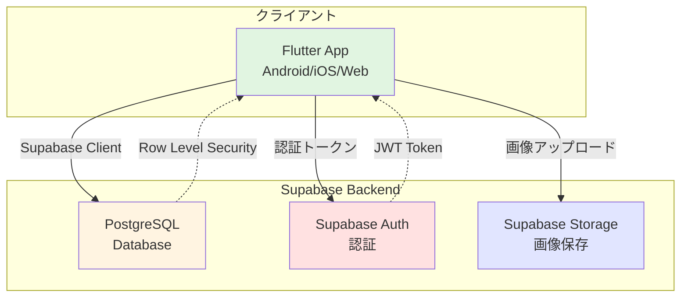
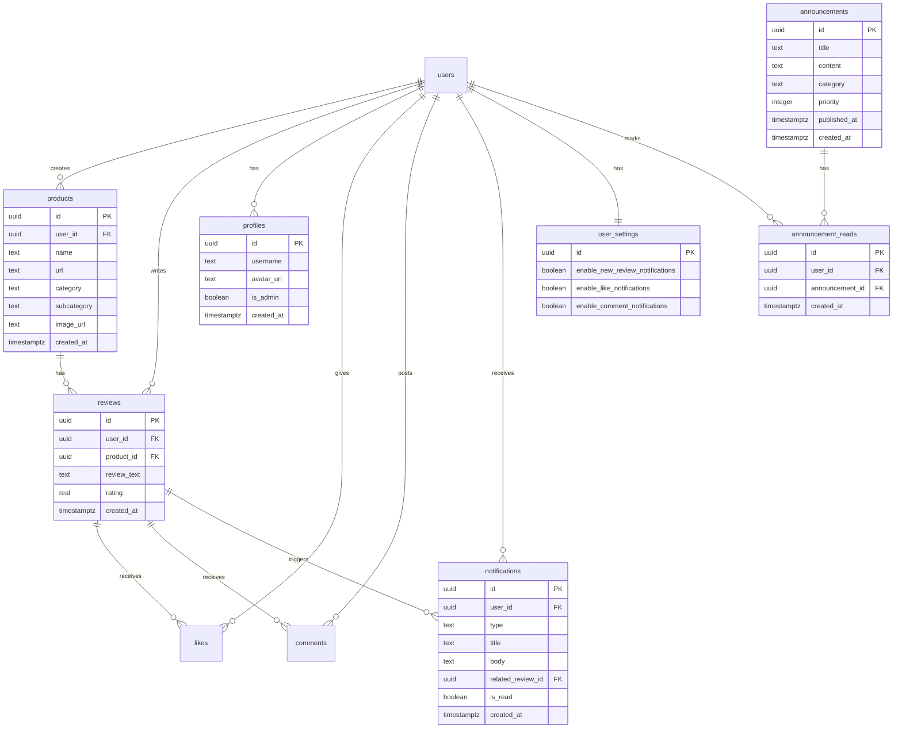

# FavLog (Favorite Log)

<div align="center">

**信頼できる仲間と商品・サービスのレビューを共有するクローズドコミュニティアプリ**

[](https://flutter.dev/)
[](https://dart.dev/)
[](https://supabase.com/)

[機能紹介](#主な機能) | [セットアップガイド](#環境セットアップ) | [ドキュメント](#ドキュメント)

</div>

---

## 📚 目次

- [概要](#概要)
- [主な機能](#主な機能)
- [技術スタック](#技術スタック)
- [アーキテクチャ](#アーキテクチャ)
- [環境セットアップ](#環境セットアップ)
- [セキュリティ](#セキュリティ)
- [ドキュメント](#ドキュメント)
- [テスト](#テスト)
- [今後の拡張](#今後の拡張)
- [開発者情報](#開発者情報)

---

## 概要

FavLogは、クローズドなコミュニティ（友人、家族、同僚など）内で商品やサービスのレビューを共有するためのAndroidアプリケーションです。検索アルゴリズムではなく、信頼できる関係に基づいた選択を支援します。

**特徴:**
- 📝 詳細なレビュー投稿（0.5単位の星評価、カテゴリ、サブカテゴリ）
- 💬 ソーシャル機能（いいね、コメント、通知）
- 🔔 リアルタイム通知（新規レビュー、いいね、コメント）
- 🔍 高度な検索・フィルタリング（動的な「人気のキーワード」）
- 🔄 **セルフアップデート機能**（アプリ内からの自動更新）
- 📱 レスポンシブデザイン（モバイル・タブレット・Web対応）
- 🔒 Row Level Security（RLS）によるセキュアなデータ管理

---

## 主な機能

### 1. レビュー管理

#### レビュー投稿
- **商品情報**: 商品名、URL、カテゴリ、サブカテゴリ（オートコンプリート対応）
- **評価システム**: 0.5単位の星評価（1.0〜5.0）
- **画像アップロード**: 自動的にWebP/JPEG形式に変換・圧縮
- **詳細レビュー**: 自由記述のレビューテキスト

#### レビュー表示
- **ホーム画面**: 商品の平均評価と最新レビュー1件を表示
- **詳細画面**: 商品のすべてのレビューを一覧表示
- **無限スクロール**: 動的なデータ読み込み
- **Shimmer効果**: ローディング中の視覚的フィードバック
- **プルツーリフレッシュ**: 手動データ更新

#### レビュー編集・削除
- **編集機能**: 自身のレビューの評価とテキストを更新可能
- **削除機能**: 自身のレビューを削除可能
- **商品情報編集**: RLSポリシーにより、作成者または管理者が商品情報を編集可能

### 2. ソーシャル機能

#### いいね機能
- レビューに対していいねを付与
- いいね数のリアルタイム表示
- ハートアイコンで視覚的フィードバック
- いいね時にレビュー作成者に通知

#### コメント機能
- レビューに対してコメントを投稿
- ユーザーのプロフィール画像と名前を表示
- 自分のコメントは削除可能
- コメント投稿時にレビュー作成者に通知

#### 🔔 通知機能

**アプリ内通知（In-App Notifications）**
- **新規レビュー通知**: すべてのユーザーに通知
- **いいね通知**: 自分が書いたレビューにいいねがついたときに通知
- **コメント通知**: 自分が書いたレビューにコメントがついたときに通知
- **通知設定**: 設定画面で各通知タイプごとにON/OFF可能
- **既読管理**: 通知の既読/未読状態を管理
- **通知バッジ**: 未読通知数を視覚的に表示

**📲 プッシュ通知（Push Notifications）**
- **Firebase Cloud Messaging (FCM)**: アプリ外でも通知を受信
- **デバイストークン管理**: ユーザーごとのFCMトークンをSupabaseで管理
- **フォアグラウンド/バックグラウンド対応**: アプリの起動状態に関わらず通知を受信
- **全イベント対応**: 新規レビュー・いいね・コメントのすべてでプッシュ通知を送信
- **通知連携**: アプリ内通知と同タイミングでプッシュ通知を送信
- **通知設定の尊重**: ユーザーの通知設定に従ってプッシュ通知も制御
- **Supabase Edge Function**: FCM HTTP v1 APIでの通知配信
- **重複防止**: 1ユーザー・1デバイスタイプにつき1トークンのみ保持
- **通知タップ遷移**: 通知タップ時に対象のレビュー詳細画面へ直接遷移

#### 📢 お知らせ機能
- **管理者専用**: 管理者のみがお知らせを作成・編集・削除可能
- **カテゴリ分類**: アップデート、メンテナンス、お知らせの3種類
- **優先度設定**: 高・中・低の3段階
- **公開時間指定**: お知らせの公開日時を指定可能（JST対応）
- **未読管理**: ユーザーごとに未読お知らせ数を表示
- **既読機能**: お知らせ詳細画面を開くと自動的に既読にマーク

### 3. 検索・フィルタリング

#### カテゴリフィルタリング
- ホーム画面でカテゴリを選択してレビューを絞り込み
- 「すべて」カテゴリで全レビューを表示

#### 検索機能
- 専用の検索画面で横断検索
- **人気のキーワード**: ユーザーのアクティビティに基づいた動的なキーワード表示（時間減衰付き重み付けスコア）
- 商品名、サービス名、タグ、ユーザー名で検索可能
- デバウンス処理によるリアルタイム検索
- 検索結果の0.5単位星評価表示
- **検索履歴の永続化**: SharedPreferencesにより、アプリ再起動後も検索履歴を保持

#### ソート機能
- 「すべて」「新しい順」「高評価順」でソート

### 4. セルフアップデート機能（Android）

#### 自動更新
- **起動時チェック**: アプリ起動時に自動でバージョンチェックを実行（24時間に1回）
- **更新ダイアログ**: 新しいバージョンがある場合にホーム画面へのダイアログで通知
- **強制アップデート**: 特定のバージョン未満の場合に利用を制限し更新を促す
- **OTA (Over-the-Air)**: アプリ内から直接APKをダウンロード・インストール

#### インストールガイド
- **権限チェック**: アップデート実行時にインストール権限を確認し、未許可の場合はガイド画面へ自動遷移
- **設定誘導**: 「不明なアプリのインストール」権限が必要な場合に設定画面へ誘導
- **視覚的ガイド**: 権限許可の手順を分かりやすく解説するガイド画面を搭載

### 5. プロフィール管理

- **ユーザー名設定**: 一意のユーザー名
- **アバター画像**: プロフィール画像のアップロード・更新
- **自動削除**: 既存アバターの自動削除機能
- **レビュー一覧**: 自分が投稿したレビューを表示
- **いいね一覧**: 自分がいいねしたレビューを表示
- **パフォーマンス最適化**: Riverpodプロバイダーによるデータキャッシュで高速表示

### 6. 認証機能

- **ユーザー登録**: メールアドレスとパスワード
- **ログイン/ログアウト**: セキュアな認証フロー
- **メール認証**: 認証メールの送信と再送機能
- **JWT管理**: 有効期限切れ時の自動ログアウトと再認証誘導

---

## 技術スタック

### クライアント
| 技術 | バージョン | 用途 |
|------|-----------|------|
| **Flutter** | 3.10+ | クロスプラットフォームフレームワーク |
| **Dart** | 3.10+ | プログラミング言語 |
| **Riverpod** | 2.5.1 | 状態管理 |
| **go_router** | 17.0.0 | ルーティング・ナビゲーション |
| **cached_network_image** | 3.3.1 | 画像キャッシュ |
| **shimmer** | 3.0.0 | ローディングエフェクト |
| **ota_update** | 7.1.0 | APKダウンロード・インストール |
| **package_info_plus** | 8.0.0 | アプリバージョン情報取得 |
| **app_links** | 6.4.1 | ディープリンク管理 |
| **intl** | 0.19.0 | 国際化・日付フォーマット |
| **timeago** | 3.7.0 | 相対時刻表示 |
| **badges** | 3.1.2 | 通知バッジ |
| **firebase_core** | 3.8.1 | Firebase初期化 |
| **firebase_messaging** | 15.1.5 | FCMプッシュ通知 |
| **flutter_local_notifications** | 17.0.0 | ローカル通知表示 |

### バックエンド
| サービス | 用途 |
|----------|------|
| **Supabase PostgreSQL** | リレーショナルデータベース |
| **Supabase Auth** | ユーザー認証・セッション管理 |
| **Supabase Storage** | 画像ストレージ（product_images、avatars） |
| **Supabase Edge Functions** | サーバーレス関数（プッシュ通知送信） |
| **Supabase RLS** | Row Level Security（行レベルセキュリティ） |

### ユーティリティ
| ライブラリ | 用途 |
|-----------|------|
| **flutter_dotenv** | 環境変数管理 |
| **image** | 画像処理（WebP/JPEG） |
| **flutter_image_compress** | 画像圧縮 |
| **url_launcher** | URLリンクの起動 |
| **image_picker** | 画像選択 |
| **permission_handler** | 権限管理（インストール権限等） |
| **device_info_plus** | デバイス情報・SDKバージョン取得 |
| **android_intent_plus** | システム設定画面への遷移 |
| **uuid** | UUIDの生成 |

---

## アーキテクチャ

### システム構成図


```mermaid
graph TB
    subgraph "クライアント"
        A[Flutter App<br/>Android/iOS/Web]
    end
    
    subgraph "Supabase Backend"
        B[PostgreSQL<br/>Database]
        C[Supabase Auth<br/>認証]
        D[Supabase Storage<br/>画像保存]
    end
    
    A -->|Supabase Client| B
    A -->|認証トークン| C
    A -->|画像アップロード| D
    
    B -.->|Row Level Security| A
    C -.->|JWT Token| A
    
    style A fill:#e1f5e1
    style B fill:#fff4e1
    style C fill:#ffe1e1
    style D fill:#e1e5ff
```

### データベーススキーマ


```mermaid
erDiagram
    users ||--o{ products : creates
    users ||--o{ reviews : writes
    users ||--o{ profiles : has
    users ||--o{ likes : gives
    users ||--o{ comments : posts
    users ||--o{ notifications : receives
    users ||--|| user_settings : has
    users ||--o{ announcement_reads : marks
    
    products ||--o{ reviews : has
    reviews ||--o{ likes : receives
    reviews ||--o{ comments : receives
    reviews ||--o{ notifications : triggers
    
    announcements ||--o{ announcement_reads : has
    
    products {
        uuid id PK
        uuid user_id FK
        text name
        text url
        text category
        text subcategory
        text image_url
        timestamptz created_at
    }
    
    reviews {
        uuid id PK
        uuid user_id FK
        uuid product_id FK
        text review_text
        real rating
        timestamptz created_at
    }
    
    profiles {
        uuid id PK
        text username
        text avatar_url
        boolean is_admin
        timestamptz created_at
    }
    
    announcements {
        uuid id PK
        text title
        text content
        text category
        integer priority
        timestamptz published_at
        timestamptz created_at
    }
    
    announcement_reads {
        uuid id PK
        uuid user_id FK
        uuid announcement_id FK
        timestamptz created_at
    }
    
    notifications {
        uuid id PK
        uuid user_id FK
        text type
        text title
        text body
        uuid related_review_id FK
        boolean is_read
        timestamptz created_at
    }
    
    user_settings {
        uuid id PK
        boolean enable_new_review_notifications
        boolean enable_like_notifications
        boolean enable_comment_notifications
    }
```

### レスポンシブデザイン

| デバイス | 画面幅 | レイアウト |
|---------|--------|-----------|
| **スマートフォン** | < 600px | `ListView`（縦一列） |
| **タブレット** | 600px〜1200px | `GridView`（2列） |
| **デスクトップ** | > 1200px | `GridView`（3列以上） |

---

## 環境セットアップ

### 前提条件

- **Flutter SDK**: 3.10以上 - [インストールガイド](https://flutter.dev/docs/get-started/install)
- **Android Studio**: [ダウンロード](https://developer.android.com/studio)
- **Git**: [ダウンロード](https://git-scm.com/downloads)
- **Supabaseアカウント**: [登録](https://supabase.com/)

### クイックスタート

#### 1. リポジトリのクローン

```bash
git clone https://github.com/kyo09427/favlog_app.git
cd favlog_app
```

#### 2. 依存関係のインストール

```bash
flutter pub get
```

#### 3. Flutter環境の確認

```bash
flutter doctor
```

問題がある場合は、出力される指示に従って修正してください。

#### 4. Android固有の設定（セルフアップデート用）

Androidでアプリ内アップデートを行うために、`android/app/src/main/AndroidManifest.xml` に以下の権限が必要です：

```xml
<uses-permission android:name="android.permission.REQUEST_INSTALL_PACKAGES" />
```

#### 5. 環境変数の設定

プロジェクトのルートに `.env` ファイルを作成し、以下を記述：

```env
SUPABASE_URL=https://YOUR_PROJECT_REF.supabase.co
SUPABASE_ANON_KEY=eyJ...
```

> **⚠️ 重要**: `.env`ファイルは`.gitignore`に含まれており、Gitにコミットされません。

#### 5. アセットの配置

`assets/categories.json` を作成し、以下を記述：

```json
{
  "categories": [
    "すべて",
    "本",
    "家電",
    "食品",
    "ファッション",
    "ゲーム",
    "映画/音楽",
    "サービス",
    "その他"
  ]
}
```

#### 6. Supabaseのセットアップ

詳細な手順は **[docs/database_setup.md](docs/database_setup.md)** を参照してください。

主なステップ：
- Supabaseプロジェクトの作成
- データベーステーブルの作成（products, profiles, reviews, likes, comments, notifications, user_settings, announcements, announcement_reads）
- RLSポリシーの設定
- Storageバケットの作成（product_images, avatars）

#### 7. アプリケーションの実行

```bash
flutter run
```

エミュレータまたは接続されたデバイスでアプリケーションが起動します。

---

## セキュリティ

### Row Level Security (RLS)

FavLogアプリでは、Supabaseの**Row Level Security（行レベルセキュリティ）**を活用し、データへのアクセスを細かく制御しています。

#### 主要なセキュリティポリシー

| テーブル | ポリシー | 説明 |
|---------|---------|------|
| **products** | 作成者または管理者が編集可能 | `auth.uid() = user_id OR is_admin = TRUE` |
| **reviews** | 作成者のみ編集/削除可能 | `auth.uid() = user_id` |
| **likes** | 作成者のみ削除可能 | `auth.uid() = user_id` |
| **comments** | 作成者のみ編集/削除可能 | `auth.uid() = user_id` |
| **notifications** | 自分の通知のみ閲覧/更新/削除可能 | `auth.uid() = user_id` |
| **user_settings** | 自分の設定のみ閲覧/更新可能 | `auth.uid() = id` |
| **announcements** | 全ユーザー閲覧可能、管理者のみ作成/編集/削除 | `is_admin = TRUE` |
| **announcement_reads** | 自分の既読情報のみ閲覧/追加/削除可能 | `auth.uid() = user_id` |

#### セキュリティチェックリスト

- [x] APIキーは`.env`ファイルに保存（`.gitignore`で除外）
- [x] RLSポリシーによるデータベースレベルのアクセス制御
- [x] JWT有効期限切れ時の自動ログアウト
- [x] 画像アップロードの認証必須
- [x] 通知の送信者検証

詳細は **[docs/technical_details.md](docs/technical_details.md)** を参照してください。

### プラットフォーム別画像最適化

セキュリティとパフォーマンスを両立するため、プラットフォームに応じて画像形式を自動選択：

- **ネイティブアプリ（Android/iOS）**: WebP形式（ファイルサイズ20-30%削減）
- **Webアプリ**: JPEG形式（ブラウザ互換性）

---

## ドキュメント

詳細な技術情報は以下のドキュメントを参照してください：

| ドキュメント | 内容 |
|------------|------|
| **[データベースセットアップ](docs/database_setup.md)** | Supabaseプロジェクトのセットアップ、全テーブルスキーマ、RPC関数、Storage設定 |
| **[セルフアップデート](docs/self_update.md)** | アプリ内更新機能の仕組み、GitHub Actions連携、Android設定 |
| **[人気キーワード](docs/POPULAR_KEYWORDS_SPECIFICATION.md)** | 検索画面のキーワードランキングアルゴリズム（時間減衰スコア）の仕様 |
| **[デプロイメント](docs/deployment.md)** | Androidリリース署名設定、CI/CD（GitHub Actions）の設定 |
| **[技術詳細](docs/technical_details.md)** | プラットフォーム別画像最適化、Row Level Security、エラーハンドリング |

---

## テスト

主要な機能が正しく動作するか、以下の点を確認してください：

### 認証とプロフィール
- ✅ **新規ユーザー登録**: メール認証画面が表示され、認証メールを再送できること
- ✅ **ログイン/ログアウト**: 正常に動作すること
- ✅ **JWT有効期限切れ**: 自動的にログアウトされること
- ✅ **プロフィール編集**: ユーザー名とアバター画像を更新できること

### レビュー機能
- ✅ **レビュー投稿**: カテゴリ選択（ChoiceChip）、サブカテゴリのオートコンプリート、画像圧縮が正常に動作
- ✅ **レビュー表示**: ホーム画面でShimmer効果、画像キャッシュ、無限スクロールが動作
- ✅ **レビュー編集・削除**: 自身のレビューを編集・削除できること
- ✅ **商品情報編集**: 自分が作成した商品、または管理者の場合は他人の商品も編集できること（RLSポリシー）

### ソーシャル機能
- ✅ **いいね機能**: いいね/いいね解除が正常に動作し、いいね数が表示されること
- ✅ **コメント機能**: コメントの投稿・表示・削除が正常に動作すること
- ✅ **通知機能**: 新規レビュー、いいね、コメントで通知が生成されること
- ✅ **通知設定**: 設定画面で各通知タイプをON/OFFできること
- ✅ **通知バッジ**: 未読通知数が正しく表示されること
- ✅ **通知タップ遷移**: 通知タップで対象レビュー詳細画面に遷移すること

### その他
- ✅ **カテゴリフィルタリング**: カテゴリ選択でレビューが正しく絞り込まれること
- ✅ **検索機能**: 商品名、ユーザー名、人気のキーワードで検索できること
- ✅ **検索履歴の永続化**: アプリ再起動後も検索履歴が保持されること
- ✅ **セルフアップデート**: 新バージョン検知時にダイアログが表示され、正常にインストールが開始されること
- ✅ **レスポンシブデザイン**: モバイルではListView、タブレット/WebではGridViewで表示
- ✅ **エラーハンドリング**: 統一されたエラーダイアログが表示されること

---

## 今後の拡張

- 📱 GitHub Pagesを用いたWeb版への対応
- 📂 カテゴリ機能の強化（ネストされたサブカテゴリなど）
- 👥 ユーザー検索・フォロー機能
- 📊 ダッシュボード機能（統計・分析）
- 🌐 多言語対応（i18n）
- 📜 ホーム画面のページネーション実装

---

## バージョン履歴

### v2.8.0（2026-04-12）

アップデート機能のコード品質・堅牢性を全面改善したリファクタリングリリース。

#### バグ修正
- **リスナーリーク修正**: ダウンロード進捗ダイアログで `StatefulBuilder` を使っていたため、`setState` のたびにストリームリスナーが追加され続けていた問題を修正。`_DownloadProgressScreen` として専用の `StatefulWidget` に置き換え、`initState` / `dispose` でサブスクリプションを確実に管理するよう変更
- **CDNキャッシュ問題の修正**: Cloudflare Pages の `version.json` がキャッシュされてアップデートが正しく検知されない問題を修正。HTTPリクエストに `Cache-Control: no-cache` ヘッダーを追加

#### コード品質改善
- **HTTP重複呼び出し解消**: アップデートチェック時に `version.json` を最大3回フェッチしていた問題を修正。`showAutoUpdateCheck()` を1回のフェッチで全情報を取得するよう書き直し
- **バージョン比較の安全化**: `_compareVersions` で `int.parse` を使用していたため、バージョン文字列のフォーマット異常でクラッシュする可能性があった。`int.tryParse(p) ?? 0` に変更。また外部から利用できるよう `public` メソッドに変更
- **`VersionInfo.fromJson` のキャスト安全化**: `json['versionCode'] as int` を `(json['versionCode'] as num).toInt()` に変更し、JSONの数値型の違いによる `TypeError` を防止
- **重複ロジック削除**: `main.dart` に存在した `_checkForUpdates` / `_showUpdateDialog` は `scaffold_with_nav_bar.dart` の `showAutoUpdateCheck()` と実質同じ処理であり、かつ Android ガード（`kIsWeb` チェック）がなかったため削除。アップデートチェックを `scaffold_with_nav_bar.dart` 側に一本化

#### CI/CD 改善
- **AABビルド時のリリース失敗を防止**: `android_build.yml` のリリースステップに `fail_on_unmatched_files: false` を追加し、`build_type: aab` 選択時にAPKファイルが存在しなくてもリリースが失敗しないよう修正
- **Webビルドの `.env` に `DISCORD_TARGET_GUILD_ID` を追加**: `web_apk_build.yml` の `.env` 生成ステップに `DISCORD_TARGET_GUILD_ID` が含まれていなかった不整合を修正

---

### v2.7.0（2026-04-12）

Android 版の URL 開封問題修正と、アプリ起動時の自動アップデートチェック機能を追加。

#### バグ修正
- **Android URL 開封修正**: Android 11+ のパッケージ可視性制限（Package Visibility）により外部リンクが開けない問題を修正
  - `AndroidManifest.xml` の `<queries>` に http/https インテントを追加
  - `canLaunchUrl()` による事前チェックを廃止し、`try-catch` で直接 `launchUrl()` する方式に変更（`review_detail_screen`・`settings_screen`）

#### 新機能
- **起動時自動アップデートチェック（Android）**: アプリ起動時にバックグラウンドでバージョンチェックを実行
  - 24時間以内に確認済みの場合はスキップ
  - 更新がある場合はホーム画面上にダイアログを表示
  - インストール権限（REQUEST_INSTALL_PACKAGES）が未許可の場合、許可ガイド画面へ自動遷移
  - Web 版では `kIsWeb` チェックにより安全にスキップ

---

### v2.6.0（2026-04-12）

コード品質・安定性・アーキテクチャを全面的に改善したリファクタリングリリース。

#### 安定性（Phase 1）
- **N+1クエリ解消**: 通知送信時のユーザーごと個別クエリを `IN` 句による一括取得に変更（大規模ユーザー環境でのパフォーマンス大幅改善）
- **Riverpod キャッシュ戦略修正**: `autoDispose` + `ref.keepAlive()` の矛盾を解消し、意図通りの永続キャッシュに統一
- **null 安全性強化**: 強制アンラップ `!` を明示的な null チェック＋エラーメッセージに置換（`add_product_controller`・`edit_product_controller`・`add_review_controller`）
- **型安全性向上**: `Future.wait` の `as` キャストを Dart 3 のレコード構文 `(f1, f2).wait` に置換

#### アーキテクチャ（Phase 2）
- **通知ロジック分離**: `PushNotificationHelper` をリポジトリ内部生成からコンストラクタ注入（DI）に変更
- **Provider 配置整理**: `lib/providers/` の孤立ファイルを `lib/core/providers/` に統合、空ディレクトリを削除
- **FCMService の Riverpod 依存除去**: `Ref` フィールドを廃止し `FCMTokenRepository`・`AuthRepository` を直接 DI（テスト容易性向上）
- **エラーハンドリング統一**: `AppException` / `RepositoryException` / `AuthAppException` / `ValidationException` 階層を新設、`catch (_) {}` のサイレント失敗を `AppLogger.error` に変更
- **カラーコード定数化**: `AppColors` クラスを新設し、32ファイルに散在していたカラーコードを一括置換

#### コード品質（Phase 3）
- **マジックナンバー定数化**: `AppLimits` クラスを新設（キャッシュ有効期限・画像最大枚数・スクロール閾値・検索履歴最大件数）
- **ロギング統一**: `AppLogger` ユーティリティを新設。`kDebugMode` フラグによりリリースビルドでのログ出力を抑制
- **URL バリデーション強化**: ホスト検証を追加し `localhost`・内部 IP（10.x.x.x / 192.168.x.x / 172.16-31.x.x / 127.x.x.x）をブロック
- **通知タップ遷移の実装**: FCMService にコールバックパターンを導入し、通知タップ時に対象レビュー詳細画面へ遷移
- **検索履歴の永続化**: `SharedPreferences` による保存・復元を実装（アプリ再起動後も履歴を保持）
- **TextEditingController の Provider 化**: `searchScreenControllerProvider` を新設し `SearchScreen` の手動 `initState`/`dispose` 管理を除去

---

## 開発者情報

- **アプリ名**: FavLog (Favorite Log)
- **制作者**: kyo09427 / shu5555
- **リポジトリ**: https://github.com/kyo09427/favlog_app
- **バージョン**: 2.8.0

---

## ライセンス

This project is proprietary software. All rights reserved.

---

<div align="center">

**Made with ❤️ using Flutter and Supabase**

</div>
